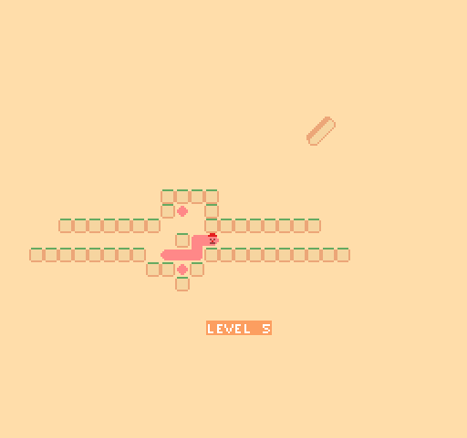

# (TODO: your game's title)

Author: Alyssa Lee

Design: You are Mister Hot Dog, a sausage looking for a bun. Collect meat to gain length and reach your goal. 

Screen Shot:

How Your Asset Pipeline Works:
I drew the tiles and levels as .png files. pack_tiles.cpp turns the images into a .bin file which is then loaded into the game at runtime. 

How To Play:
Use the arrow keys to move, collecting meat to increase your length and reach the bun. At least one of your sections must remain on the ground. Press "R" to restart a level if you get stuck. 

Sources: 
assets made by Alyssa 

This game was built with [NEST](NEST.md).

